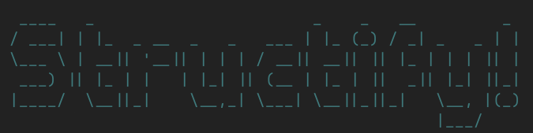

<p align="center">
  
</p>

<h1 align="center">Structify</h1>

<p align="center">
  <strong>A powerful and interactive CLI tool that helps you document, organize, and archive your project's file structure into a single Markdown file.</strong>
</p>

<p align="center">
  Whether you want to share project code snippets, review your codebase, or back up key files, Structify makes it fast and flexible.
</p>

---

## 🚀 Features

✅ **Full or Partial Collection** – Collect the entire project or interactively select only the files and folders you need.
✅ **Interactive Multi-Level Selection** – Navigate through directories and decide whether to include entire folders or specific files.
✅ **Auto-Ignored Resources** – Skips unnecessary files like `node_modules`, `.env`, images, and fonts. Resource-only directories are flagged in the output.
✅ **Easy-to-Read Markdown Output** – All selected files are merged into a single `.md` file, with clear separators and code blocks for easy navigation.

---

## 📦 Installation

### Prerequisites

- **Node.js** (v18+ recommended)
- **pnpm** (preferred) or **npm**/**yarn**

### Steps

1. Clone the repository:

```bash
git clone https://github.com/your-username/structify.git
cd structify
```

2. Install dependencies:

```bash
pnpm install
```

3. Build the project:

```bash
pnpm build
```

4. Run the CLI:

```bash
pnpm start
```

---

### 🏃 Usage

Structify supports two modes of operation: **Interactive Mode** (default) and **Non-Interactive Mode** (using CLI arguments).

#### Interactive Mode (Default)

Simply run:

```bash
pnpm start
```

In this mode, you will be prompted for:

- **Project Directory:** The path to the project (default: current directory).
- **Collection Mode:** Choose between collecting the entire project or a selective, multi-level selection.
- **Output Settings:** Provide the name and destination directory for the generated Markdown file.

#### Non-Interactive Mode

For automated or scripted usage, you can disable interactive prompts by using the `--no-interactive` flag along with the required options. For example:

```bash
pnpm start --no-interactive --project /absolute/path/to/project --mode all --output structure.md --outdir /absolute/path/to/save
```

**Options:**

- `--no-interactive`: Disables interactive prompts.
- `--project <path>`: Specifies the project directory to process.
- `--mode <mode>`: Sets the collection mode. Use `all` to collect the entire project. _(Note: Non-interactive mode does not support partial selection.)_
- `--output <filename>`: The name of the output Markdown file (default: `output.md`).
- `--outdir <directory>`: The directory where the output file will be saved.

To view the full list of available CLI options, run:

```bash
pnpm start -- --help
```
